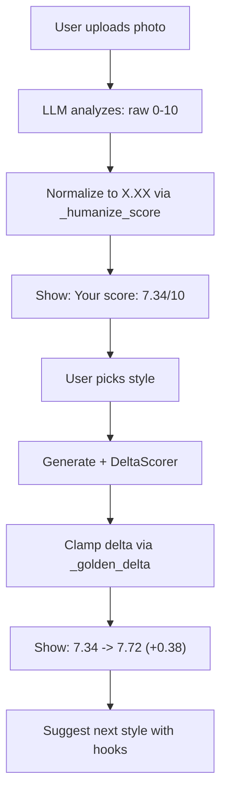

# Gamification Scoring System Redesign

## Current Problems

1. **No initial score before generation** -- the user never sees their "before" score in a standalone message. It only appears inside the delta after generation (`7.5 -> 7`), so the user has no baseline to anchor against.
2. **Inconsistent precision** -- `_format_score_val` strips decimals: `7.0 -> "7"`, `6.5 -> "6.5"`. This creates a feeling of arbitrary rounding, not precision.
3. **Unrealistic deltas** -- LLM can return `+2`, `+3`, or even `-0.5` swings. Large jumps feel fake; negative deltas destroy engagement.
4. **No visual cues** -- no green/red coloring, no progress bar, no "leveling up" feel. Just plain text like `+0 (7.5 -> 7.5)`.
5. **Scale confusion** -- scores are 0-10 integers from the LLM, but gamification works better with fractional "expert-level precision" (e.g. `7.34` feels more trustworthy than `7`).

## Design Principles

Based on gamification best practices:

- **Golden Ratio pacing**: deltas should follow diminishing returns -- each improvement feels meaningful but not absurdly large. Max delta per generation capped at `+0.61` (1/phi), typical range `+0.08..+0.38`.
- **Always hundredths**: all scores displayed as `X.XX` -- creates perception of a precise analytical system.
- **Always positive (or zero)**: no negative deltas shown to users -- if the LLM returns a lower score, show `+0.00` and focus on qualitative feedback.
- **Visual progress**: green arrows for positive change, neutral for zero. Progress bar showing distance to next "level" tier.
- **Anchor with initial score**: show the starting score right after analysis, so the user has a reference point.

## Score Flow (proposed)



## Implementation Details

### 1. Normalize LLM scores to precise hundredths

**File:** [src/orchestrator/pipeline.py](src/orchestrator/pipeline.py)

After `_analyze` returns `result_dict`, apply a normalization pass that converts every score from raw LLM integer/float to a "humanized" value with golden-ratio-based fractional parts:

```python
def _humanize_score(raw: float, seed: str) -> float:
    """Convert raw 0-10 to X.XX with natural-feeling fractional part."""
    base = int(raw)
    raw_frac = raw - base
    h = int(hashlib.md5(seed.encode()).hexdigest()[:6], 16)
    # Generate a fractional part that feels precise but consistent
    frac = (h % 100) / 100.0
    # Blend: if LLM gave e.g. 7.5, keep close to 7.5 but add hundredths
    if raw_frac > 0:
        frac = round(raw_frac + (frac - 0.5) * 0.1, 2)
    result = base + max(0.01, min(0.99, frac))
    return round(min(9.99, max(0.01, result)), 2)
```

Apply to all score keys (`dating_score`, `trust`, `competence`, `hireability`, `social_score`) in `result_dict` after analysis, using `f"{task_id}:{key}"` as seed for determinism.

This runs in `pipeline.py` method `execute()` right after `_analyze()` returns and before `single_pass()`.

### 2. Clamp deltas to golden-ratio range

**File:** [src/orchestrator/executor.py](src/orchestrator/executor.py), in `DeltaScorer.compute`

After computing raw `post - pre`, clamp the delta to a psychologically appealing range:

```python
PHI = 1.618
MAX_DELTA = round(1 / PHI, 2)  # 0.62
MIN_POSITIVE_DELTA = 0.03

def _golden_delta(raw_delta: float) -> float:
    """Clamp delta to gamification-friendly range, never negative."""
    if raw_delta <= 0:
        return 0.0
    clamped = min(raw_delta, MAX_DELTA)
    return round(max(clamped, MIN_POSITIVE_DELTA), 2)
```

Apply to each delta value. The `pre` stays as the humanized original score, `post` = `pre + golden_delta`. This ensures:
- No negative progress shown (floor at 0.00)
- Max single-step gain is +0.62 (1/phi)
- Typical gains are +0.08..+0.38 -- feels real, not inflated

### 3. Always show initial score in the result message

**File:** [src/bot/handlers/results.py](src/bot/handlers/results.py)

Modify `_format_score_block` to ALWAYS show the initial score, even when delta exists:

- **With delta:** Show initial score line + delta line with green indicator
- **Without delta (no gen):** Show initial score only

New display format:

```
Rating: 7.34/10

After enhancement:
  Attractiveness: 7.34 -> 7.72 (+0.38)
```

In Telegram Markdown:
```
*Твой скор: 7.34 / 10*

*Что изменилось:*
Привлекательность: 7.34 -> 7.72 *(+0.38)*
```

The green color effect is achieved using a filled green circle Unicode character before positive deltas and bold formatting for emphasis.

### 4. Rewrite display formatters

**File:** [src/bot/handlers/results.py](src/bot/handlers/results.py)

Replace all score formatting functions:

- **`_format_score_val`**: always return `f"{val:.2f}"` -- no more stripping to integers
- **`_format_delta_fractional`**: always `f"+{val:.2f}"` for positive, `"+0.00"` for zero/negative
- **`_format_score_row`**: add green dot indicator for positive deltas

```python
def _format_score_val(val: float) -> str:
    return f"{val:.2f}"

def _format_delta_fractional(delta_val: float) -> str:
    if delta_val > 0:
        return f"+{delta_val:.2f}"
    return "+0.00"

def _format_score_row(label: str, d: dict) -> str:
    pre = _format_score_val(d["pre"])
    post = _format_score_val(d["post"])
    delta_str = _format_delta_fractional(d["delta"])
    indicator = "\u25b2" if d["delta"] > 0 else "\u25cf"  # triangle up or neutral dot
    return f"{indicator} {label}: {pre} -> {post} *({delta_str})*"
```

### 5. Update `_format_score_block` for coherent display

**File:** [src/bot/handlers/results.py](src/bot/handlers/results.py)

Redesign the score block to always show the base score first, then delta progression:

```python
def _format_score_block(mode: str, delta: dict, result: dict) -> str:
    score_map = {
        "dating": ("dating_score", "Привлекательность"),
        "cv": ("hireability", "Найм"),
        "social": ("social_score", "Соцсети"),
    }
    key, label = score_map.get(mode, ("dating_score", "Скор"))

    initial = result.get(key)
    if initial is None:
        return ""

    initial_str = _format_score_val(float(initial))
    header = f"*Твой скор: {initial_str} / 10*"

    if delta:
        delta_lines = _format_delta_lines(mode, delta)
        if delta_lines:
            return f"{header}\n\n{delta_lines}"

    return header
```

### 6. Normalize scores in DeltaScorer output

**File:** [src/orchestrator/executor.py](src/orchestrator/executor.py)

In `DeltaScorer.compute`, after getting `post_dict`, humanize the post scores the same way as pre scores (using `_humanize_score`). Then compute the delta and apply `_golden_delta` clamping. Store the rounded values with 2 decimal places.

### 7. Show initial score in `on_pick_style` preview (optional enhancement)

**File:** [src/bot/handlers/mode_select.py](src/bot/handlers/mode_select.py)

Currently the style selection message only shows hook_texts. To reinforce the gamification loop, if the initial analysis has already run (score available in `result_dict`), show: "Your current score: 7.34 -- pick a style to level up!"

This is **optional** because the initial analysis runs as part of the same pipeline as generation (not separately). So the score is only available in the result. No change needed here -- the score block in the result message handles it.

## Files Changed (summary)

| File | Change |
|------|--------|
| [src/orchestrator/pipeline.py](src/orchestrator/pipeline.py) | Add `_humanize_score`, apply to all score keys after analysis |
| [src/orchestrator/executor.py](src/orchestrator/executor.py) | Add `_golden_delta`, apply in `DeltaScorer.compute` to clamp deltas |
| [src/bot/handlers/results.py](src/bot/handlers/results.py) | Rewrite `_format_score_val`, `_format_delta_fractional`, `_format_score_row`, `_format_score_block` |
| [src/prompts/dating.py](src/prompts/dating.py) | Change prompt: "число от 0 до 10 с точностью до сотых" |
| [src/prompts/cv.py](src/prompts/cv.py) | Same prompt precision instruction |
| [src/prompts/social.py](src/prompts/social.py) | Same prompt precision instruction |

## What stays unchanged

- Pipeline orchestration flow
- Image generation (executor.single_pass)
- Identity verification
- Bot handlers flow (mode_select, keyboards)
- Enhancement advisor / style suggestions
- Worker tasks
- API layer

## Example user experience after changes

**First generation:**
```
Dating score: 7.34 / 10

Produces impression of an intelligent and pleasant person.

What changed:
  Attractiveness: 7.34 -> 7.72 (+0.38)

How to level up:
- Sydney -- bright background conveys openness
- Times Square -- energy underlines confidence
```

**Second generation:**
```
Dating score: 7.72 / 10

What changed:
  Attractiveness: 7.72 -> 7.89 (+0.17)

How to level up:
...
```

Diminishing returns (golden ratio) create a realistic "leveling up" curve -- early gains are larger, later gains are smaller, motivating the user to try more styles.
