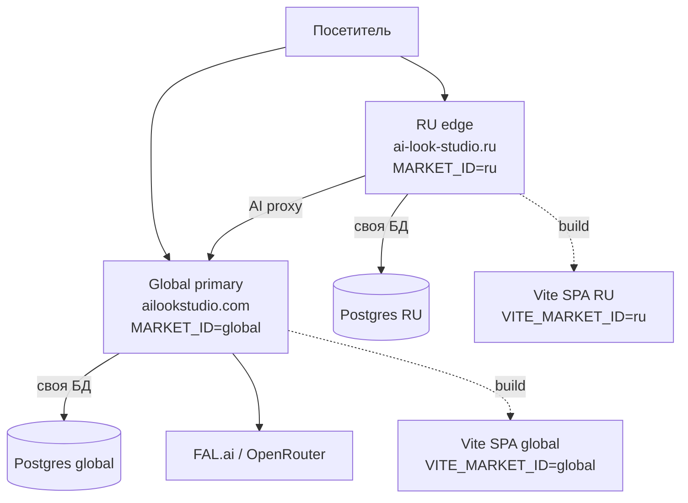
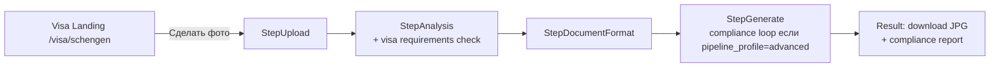

# Scenario Platform — архитектурный документ

Этот документ — операционный гайд по новой scenario-driven архитектуре RateMeAI:
формализация сценариев, мультиязычность через market-split, визовые
сценарии. Согласован на этапе планирования (см. `.cursor/plans/visas_+_i18n_+_scenario_platform_*.plan.md`)
и обновляется по мере прохождения фаз.

> **Связанные документы:**
> - [`docs/master_product_constitution.md`](../master_product_constitution.md) — продуктовое ядро
> - [`docs/ARCHITECTURE.md`](../ARCHITECTURE.md) — текущая рантайм-архитектура
> - [`docs/architecture/reserved.md`](reserved.md) — карта зарезервированного кода (multi-pass, FLUX)

---

## 1. Карта системы (как сейчас)



**Ключевой инвариант:** RU edge и global primary — это два независимых деплоя
с разными БД, разными платежами и разным контентом. Локализация — это
естественное следствие этого разделения, а не отдельный слой над single-deploy.

## 2. Что уже готово как фундамент

| Компонент | Где | Что даёт |
|---|---|---|
| Market split | `web/src/config/market.ts`, `docker-compose.ru.yml` | `VITE_MARKET_ID` → язык, провайдеры авторизации, юридические тексты |
| Scenario typing на фронте | `web/src/scenarios/config.ts` | `ScenarioDefinition` с `slug`, `step3Mode`, `paymentPackQty`, `simplifiedAnalysis` |
| Wizard `document_formats` | `web/src/components/wizard/StepDocumentFormat.tsx` | Готовый flow без выбора стилей — пригоден для виз 1-к-1 |
| Scenario-aware каталог стилей | `data/styles.json` (`scenario` field) + `GET /api/v1/catalog/scenario-styles` | Стили под конкретный лендинг исключены из основного каталога |
| Document aspect ratios | `_CV_DOCUMENT_ASPECT` в `src/orchestrator/executor.py` | Уже есть `visa_eu`, `visa_schengen`, `visa_us` |
| Reserved Scenario Engine | `src/orchestrator/advanced/` | `PipelinePlanner`, `AdvancedPipelineExecutor` под compliance-loop |
| Landing CMS | `data/landing_content.json` + `/api/v1/admin/landing/pages` | Per-server редактируемый контент |
| SEO meta SPA-side | `web/src/lib/useDocumentMeta.ts` | title / description / OG / canonical / robots |

## 3. Чего не было и что появляется

| Компонент | Где будет | Этап |
|---|---|---|
| i18next + namespace JSON | `web/src/lib/i18n.ts`, `web/src/locales/{ru,en}/*.json` | 1 |
| `<html lang>` рантайм | `web/src/App.tsx` | 1 |
| Backend Scenario dataclass | `src/scenarios/__init__.py` | 2 |
| Scenarios JSON | `data/scenarios.json` | 2 |
| Scenario loader/registry | `src/scenarios/loader.py`, `src/scenarios/registry.py` | 2 |
| Scenario API | `GET /api/v1/scenarios` | 2 |
| Visa requirements spec | `data/visa_requirements.json` | 3a |
| Visa compliance service | `src/services/visa_compliance.py` | 3a |
| VisaLanding (generic) | `web/src/pages/VisaLanding.tsx`, `VisaPage.tsx` | 3a |
| JSON-LD structured data | расширение `useDocumentMeta` | 3a/4 |

## 4. Целевая модель сценария

```python
@dataclass(frozen=True)
class OutputSpec:
    size_mm: tuple[float, float]            # (35, 45)
    dpi: int                                # 300
    background_color: str                   # "#FFFFFF"
    head_height_mm: tuple[float, float]     # (32, 36)
    aspect_key: str                         # "visa_schengen" — ключ для _CV_DOCUMENT_ASPECT


@dataclass(frozen=True)
class VisaRequirements:
    expression: Literal["neutral", "smile_allowed"]
    glasses: Literal["allowed", "forbidden", "no_tinted"]
    head_covering: Literal["forbidden", "forbidden_except_religious"]
    background: str                         # "uniform_white_or_light_grey"
    shadows: Literal["allowed", "forbidden"]
    compliance_source: str                  # URL официального источника


@dataclass(frozen=True)
class PromptOverrides:
    analysis_checklist: list[str]           # пункты для compliance-LLM
    image_instructions: str                 # текст добавляется в edit-prompt


@dataclass(frozen=True)
class PaywallConfig:
    pack_qty: int                           # 5 фото в пакете
    show_paywall: bool


@dataclass(frozen=True)
class Scenario:
    slug: str                               # "visa-schengen"
    kind: Literal["core", "document", "visa"]
    api_mode: AnalysisMode                  # CV для виз
    pipeline_profile: Literal["simple", "advanced"]
    step3_mode: Literal["styles", "document_formats"]
    output_spec: OutputSpec | None
    requirements: VisaRequirements | None
    prompt_overrides: PromptOverrides | None
    paywall: PaywallConfig | None
    landing_slug: str                       # ссылка в landing_content.json
    enabled: bool                           # default false
```

## 5. Локализация — финальная стратегия

| Слой | Где живёт | Кто редактирует | Локализация по |
|---|---|---|---|
| **UI strings (Слой A)** | `web/src/locales/{ru,en}/*.json` | Разработчики (PR) | `VITE_MARKET_ID` (build-time) |
| **Landing content (Слой B)** | `data/landing_content.json` per-server | Админы через `/admin/landing` | Per-server (естественно) |
| **Scenario configs** | `data/scenarios.json` per-server | Разработчики + админка (Phase 5+) | Per-server |
| **Visa requirements** | `data/visa_requirements.json` (read-only spec) | Разработчики | Не локализуется (юридический факт) |
| **SEO meta** | `landing_content.json` + `<html lang>` | Админы | Естественно по рынку |

RU edge билдит RU SPA с RU JSON, Global билдит EN SPA с EN JSON. Никаких
runtime-переключателей языка не нужно.

## 6. Wizard flow для визы



## 7. Инварианты

1. **Никакого `if scenario == "..."`** — только data-driven через `Scenario` registry.
2. **Все feature flags по умолчанию OFF** — ничего не активируется при простом merge.
3. **AB-тест провайдеров не трогается** — `prompt_overrides` инжектируется в prompt builder, не на уровне provider routing.
4. **Privacy layer работает as-is** для виз (тот же 152-ФЗ flow).
5. **Backward compat:** старый `scenario` тег в `styles.json` продолжает работать. Новая система запускается параллельно.
6. **Один движок:** все визовые сценарии работают через `AnalysisPipeline.execute()` → `ImageGenerationExecutor.single_pass()`. `pipeline_profile=advanced` (compliance loop) активируется через `AdvancedPipelineExecutor` из reserved кода ТОЛЬКО когда нужно.

## 8. Roadmap (для отслеживания)

- [ ] **Этап 1** — i18n инфраструктура (i18next, locales/ru, locales/en, hook)
- [ ] **Этап 1** — Перенос центральных RU-хардкодов
- [ ] **Этап 2** — Backend Scenario dataclass + loader + registry + API
- [ ] **Этап 2** — Миграция document-photo / tinder-pack
- [ ] **Этап 3a** — Pilot Schengen (полный flow)
- [ ] **Этап 3b** — USA + UK
- [ ] **Этап 3c** — Canada + Japan + China
- [ ] **Этап 3d** — UAE + Australia + Korea + India
- [ ] **Этап 4** — Полный EN locale + JSON-LD
- [ ] **Этап 5** — Unit + integration tests
- [ ] **Этап 6** — Деплой на оба сервера

Каждый этап шипится отдельным коммитом, отдельной выкаткой,
с прохождением чек-листа `.cursor/rules/deploy.mdc`.
